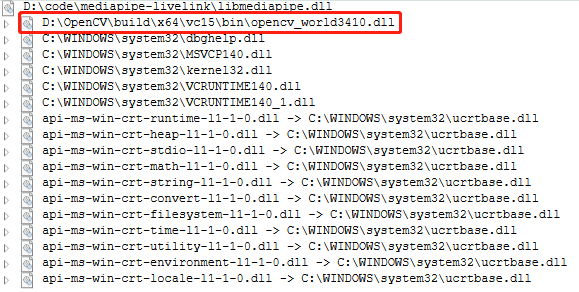

[English](README_EN.md)

# mediapipe-livelink

使用mediapipe进行面部捕捉，通过livelink传输数据至Unreal Engine。


## 如何使用

0. 配置好mediapipe的环境

1. clone mediapipe-library：

```bash
git clone https://github.com/liuyulvv/mediapipe_library.git
```

2. 获取动态链接库:

```bash
bazel build -c dbg --define MEDIAPIPE_DISABLE_GPU=1 --action_env PYTHON_BIN_PATH="D://Python//python.exe" mediapipe/library:mediapipe
bazel build -c opt --define MEDIAPIPE_DISABLE_GPU=1 --action_env PYTHON_BIN_PATH="D://Python//python.exe" mediapipe/library:mediapipe
```

根据你的需要获取`debug`(dbg)或`release`(opt)的动态链接库。你可以再`bazel-bin\mediapipe\library`中找到以下文件：

- `debug`：mediapipe.dll，mediapipe.pdb，mediapipe.if.lib
- `release`：mediapipe.dll，mediapipe.dll.if.lib

我习惯将`mediapipe.if.lib`重命名为`mediapipe.lib`，然后将`mediapipe.lib`复制到`lib`目录，`mediapipe.dll`复制到可执行程序的目录。

> 本项目的CMakeLists.txt将可执行程序输出的目录设置成项目目录。

### mediapipe-library

mediapipe提供了`face_blendshapes`的`tasks`，我对`tasks`一无所知，因此将`face_blendshapes`改成了`solution`，你能像使用`Holistic`等`solution`一样使用`face_blendshapes`。

由于`face_blendshapes`是`52`个浮点数，难以可视化，因此你无法像`Holistic`一样通过窗口进行直观的可视化。

通过[mediapipe-library](https://github.com/liuyulvv/mediapipe_library)，你可以获得mediapipe的动态链接库。

在此仅介绍如何使用`face_blendshapes`。

```cpp
#include "mediapipe_library.h"
```

首先你需要包含`mediapipe_library`头文件。

```cpp
size_t blend_shape_size = 52;
float* blend_shape_list = new float[blend_shape_size];
const std::string GRAPH_PATH = "mediapipe/graphs/face_blendshape/face_blendshape_desktop_live.pbtxt";
CreateFaceBlendShapeInterface(GRAPH_PATH.c_str());

AddFaceBlendShapePoller();

StartFaceBlendShape();
```

然后为`blend_shape`提供一个缓冲区域，大小为`52`，接着设置`face_blendshapes`的`graph`路径，最后通过`CreateFaceBlendShapeInterface`进行初始化。

`AddFaceBlendShapePoller`允许你通过`同步`的方式获取`face_blendshapes`（尽管提供了`异步`的方式，但是目前提倡使用`同步`的方式）。

`StartFaceBlendShape`开始`face_blendshapes`流程。

```cpp
FaceBlendShapeProcess(&camera_rgb_frame);

GetFaceBlendShapeOutput(blend_shape_list, blend_shape_size);
```

通过`opencv`读取一帧数据，`FaceBlendShapeProcess`处理这一帧图像（`mediapipe`需要`RGB`格式，`opencv`默认为`BGR`）。

通过`GetFaceBlendShapeOutput``同步`地获取`mediapipe`输出的`face_blendshapes`。

```cpp
delete[] blend_shape_list;
cv::destroyAllWindows();
StopFaceBlendShape();
ReleaseFaceBlendShapeInterface();
```

退出时进行资源回收。

### livelink传输

之前已经介绍了通过`mediapipe-library`提供的动态链接库如何调用`face_blendshapes`，获取`blendshapes`输出后需要通过`livelink`进行传输，本项目直接使用`asio`进行传输。由于`Unreal Engine`的`Face AR Sample`中有61个`blendshapes`，并且顺序和`face_blendshapes`不同，因此你需要调整顺序，并且补充剩下10个`blendshapes`(mediapipe提供了52个blendshapes，但是第一个无用，所以有效的仅为51个)。

### 动态链接库依赖



## Demo src

[livelink](src/main.cpp)

## 开源许可

- [asio](THIRD_LICENSE/asio/LICENSE)