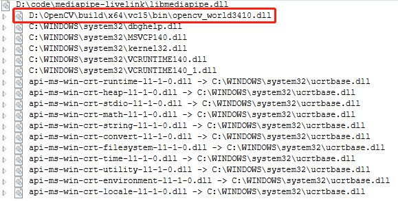

[简体中文](README.md)

# mediapipe-livelink

Use mediapipe for facial capture, and transfer data to Unreal Engine through livelink.

## How to use

0. Configure the mediapipe environment

1. clone mediapipe-library：

```bash
git clone https://github.com/liuyulvv/mediapipe_library.git
```

2. Get the dynamic link library:

```bash
bazel build -c dbg --define MEDIAPIPE_DISABLE_GPU=1 --action_env PYTHON_BIN_PATH="D://Python//python.exe" mediapipe/library:libmediapipe.dll
bazel build -c opt --define MEDIAPIPE_DISABLE_GPU=1 --action_env PYTHON_BIN_PATH="D://Python//python.exe" mediapipe/library:libmediapipe.dll
```

Get `debug` (dbg) or `release` (opt) DLL according to your needs. You can find the following files in `bazel-bin\mediapipe\library`:

- `debug`：libmediapipe.dll，libmediapipe.pdb，libmediapipe.dll.if.lib
- `release`：libmediapipe.dll，libmediapipe.dll.if.lib

I used to rename `libmediapipe.dll.if.lib` to `libmediapipe.lib`, then copy `libmediapipe.lib` to the `lib` directory, and `libmediapipe.dll` to the directory of the executable program.

> The CMakeLists.txt of this project sets the directory output by the executable program as the project directory.

### mediapipe-library

mediapipe provides `tasks` of `face_blendshapes`, I don’t know anything about `tasks`, so I changed `face_blendshapes` to `solution`, you can use `face_blendshapes` like `solution` such as `Holistic`.

Since `face_blendshapes` is a `52` float, it is difficult to visualize, so you cannot visually visualize it through the window like `Holistic`.

Through [mediapipe-library](https://github.com/liuyulvv/mediapipe_library), you can get the dynamic link library of mediapipe.

Here we only describe how to use `face_blendshapes`.

```cpp
#include "mediapipe_library.h"
```

First you need to include the `mediapipe_library` header file.

```cpp
size_t blend_shape_size = 52;
float* blend_shape_list = new float[blend_shape_size];
const std::string GRAPH_PATH = "mediapipe/graphs/face_blendshape/face_blendshape_desktop_live.pbtxt";
CreateFaceBlendShapeInterface(GRAPH_PATH.c_str());

AddFaceBlendShapePoller();

StartFaceBlendShape();
```

Then provide a buffer for `blend_shape` with a size of `52`, then set the `graph` path of `face_blendshapes`, and finally initialize it through `CreateFaceBlendShapeInterface`.

`AddFaceBlendShapePoller` allows you to get `face_blendshapes` in a `synchronous` way (although the `asynchronous` method is provided, the `synchronous` method is currently recommended).

`StartFaceBlendShape` starts the `face_blendshapes` process.

```cpp
FaceBlendShapeProcess(&camera_rgb_frame);

GetFaceBlendShapeOutput(blend_shape_list, blend_shape_size);
```

Read a frame through `opencv`, and `FaceBlendShapeProcess` processes this frame (`mediapipe` requires `RGB` format, and `opencv` defaults to `BGR`).

Get `face_blendshapes` output by `mediapipe` `synchronously` via `GetFaceBlendShapeOutput`.

```cpp
delete[] blend_shape_list;
cv::destroyAllWindows();
StopFaceBlendShape();
ReleaseFaceBlendShapeInterface();
```

Resource collection occurs on exit.

### livelink

It has been introduced before how to call `face_blendshapes` through the dynamic link library provided by `mediapipe-library`. After obtaining the output of `blendshapes`, it needs to be transmitted through `livelink`. This project directly uses `asio` for transmission. Since there are 61 `blendshapes` in the `Face AR Sample` of `Unreal Engine`, and the order is different from `face_blendshapes`, you need to adjust the order and add the remaining 10 `blendshapes` (mediapipe provides 52 blendshapes, but the first one is useless, so only 51 are valid).

### DLL dependencies



## Demo src

[livelink](src/main.cpp)

## LICENSE

- [asio](THIRD_LICENSE/asio/LICENSE)